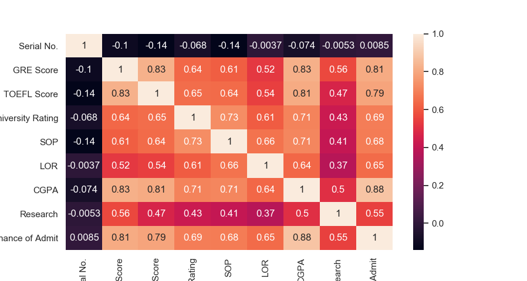
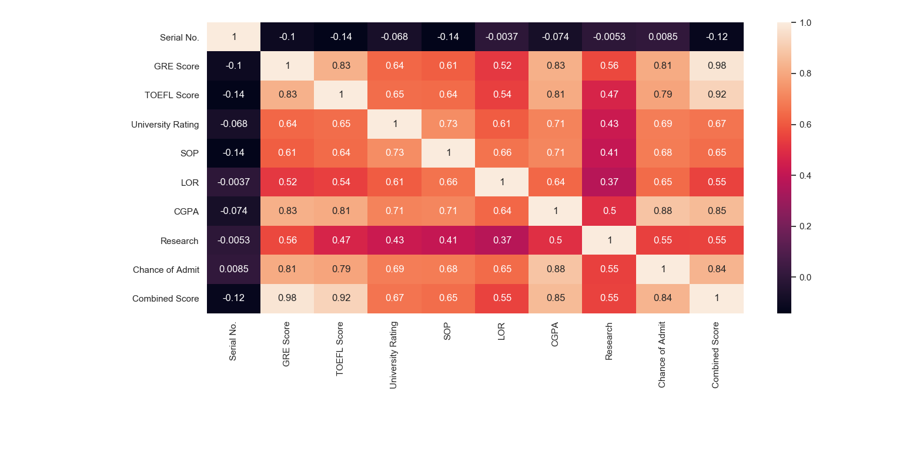
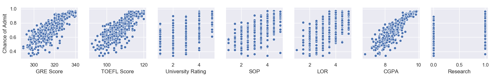

# Admission Prediction

    1. EDA visualization
    
    
    

# R2 Score

loss: 2.9482e-04 - mean_squared_error: 2.9482e-04 - val_loss: 0.0039 - val_mean_squared_error: 0.0039

r_square score:  0.770300420857444
